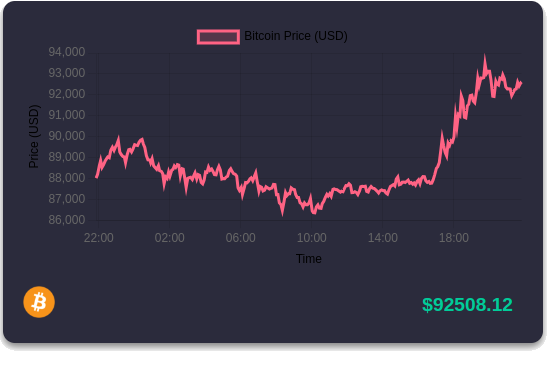

# 🪙 **crypto-chart-obs-plugin**

Welcome to the **crypto-chart-obs-plugin**! This plugin allows you to seamlessly integrate live cryptocurrency price charts (e.g., Bitcoin, Ethereum) into your OBS stream. With customizable themes and coin options, it's perfect for any streamers, traders, or crypto enthusiasts looking to display live market data during their broadcasts.

## 📸 Sample Images
Here are some sample images of the **crypto-chart-obs-plugin** in action:

  
  

## 🚀 Features
- **Live Crypto Price Charts**: Displays real-time price changes for various cryptocurrencies.
- **Customizable Themes**: Easily switch between different themes using URL query parameters.
- **History Mode**: Show historical price data (7 days, 1 month, 1 year) based on your preference.
- **Modern, Clean Design**: The chart is presented in a sleek, modern card layout, optimized for OBS.
- **Easy to Implement**: Embed the chart directly in OBS as a browser source.

## 🖥️ Getting Started

To use this plugin in OBS, follow these steps:

### 1. Install OBS
Ensure you have OBS Studio installed. You can download it [here](https://obsproject.com/).

### 2. Setup the Plugin
- Download the `crypto-chart-obs-plugin` from the [GitHub repository](#).
- Add a **Browser Source** in OBS and paste the provided URL (with the appropriate query parameters) to display the chart.
  
### 3. Configure URL Query Parameters
You can change various settings using the following URL query parameters:
- **coin**: Set which cryptocurrency to track (e.g., `bitcoin`, `ethereum`).
- **theme**: Change the chart theme (e.g., `light`, `dark`).
- **history**: Enable or disable historical data display (`7d`, `30d`, `1y`).

Example URL:

https://imaarov.github.io/crypto-chart-obs-plugin/crypto-chart.html?coin=bitcoin&theme=dark&range=day&style=capsule

https://imaarov.github.io/crypto-chart-obs-plugin/crypto-chart.html?coin=bitcoin&theme=dark&range=day&style=cart

